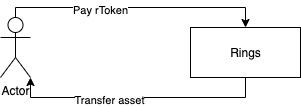
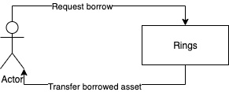

An implementation of the [compound protocol](https://github.com/compound-finance/compound-protocol) based on [Mixin](https://github.com/MixinNetwork/mixin) [MTG](https://github.com/MixinNetwork/developers.mixin.one/blob/main/developers/src/i18n/en/document/mainnet/mtg.md) technology.

## rToken

The corresponding certificate token you obtain after you supply a number of cetain encrypted currency to the market.

## Functions

### Supply

Users supply encrypted currencies to the market to provide liquidity,
and obtain the corresponding rTokens. They receive interest yields by providing liquidity.

### Pledge

Users have to pledge rToken to the market before any borrow.

### Unpledge

Users take back the rToken that pledged to the market.

### Redeem

Users return the rToken in exchange for corresponding encrypted currency that were supplied before, including interest yields as the reward for providing liquidity.

### Borrow

Users borrow encrypted currencies from the market at a certain interest rate.

### Repay

Users repay the borrowed encrypted currency and the interest accrued during the borrow period.

### Liquidation

Due to the fluctuation of the market price, the value of a user's loan may exceed that of his pledged assets. When that happens, the other users can use a lower price to obtain the user's pledged assets so that the user's debt that are not covered by pleged assets are repayed.

